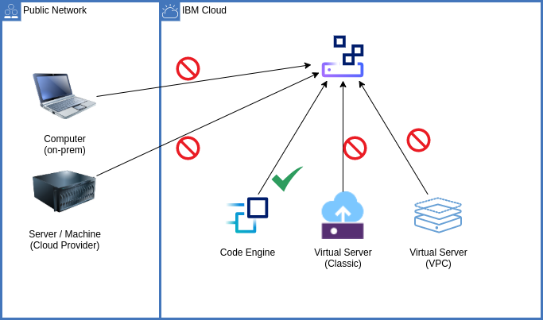
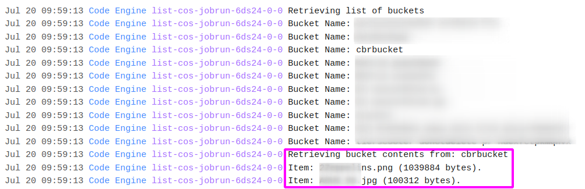
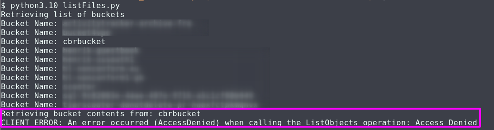

# Tests of IBM Cloud context-based-restrictions (CBR) security feature
This repository holds files for testing context-based restrictions in IBM Cloud.

The overall scenario is shown here. A Python script is deployed as job to IBM Cloud Code Engine. A jobrun, running the script, succeeds - all items in the bucket **cbrbucket** can be retrieved. With the deployed restrictions in place, running the same script from other environments fails with the access denied (see screenshots below).

Access from Code Engine succeeds:

Access from another compute environment fails. Access is denied:

## Python script to list COS buckets and bucket items

The script [listFiles.py](python/listFiles.py) is based on code samples from the [IBM Cloud Object Storage documentation](https://cloud.ibm.com/docs/cloud-object-storage?topic=cloud-object-storage-python#python-examples). It takes an API key, the COS instance CRN, and optionally the endpoint URL from environment variables or an [`.env` file](python/.env.sample). Then, it lists the available storage buckets in the COS instance, thereafter those items / files in the bucket **cbrbucket**.

You can use the provided [Dockerfile](python/Dockerfile) to [containerize the script](https://cloud.ibm.com/docs/codeengine?topic=codeengine-run-job-source-code). Thereafter, configure it as IBM Cloud Code Engine job by defining environment variables for the same API key, COS instance CRN and endpoint URL data.

## Deploy CBR network zone and access rule with Terraform
See the files in [terraform](terraform). Adapt the file [terraform.tfvars](terraform/terraform.tfvars) to your IBM Cloud API key and the name of the Cloud Object Storage instance.

## License
See the [LICENSE](LICENSE) file.